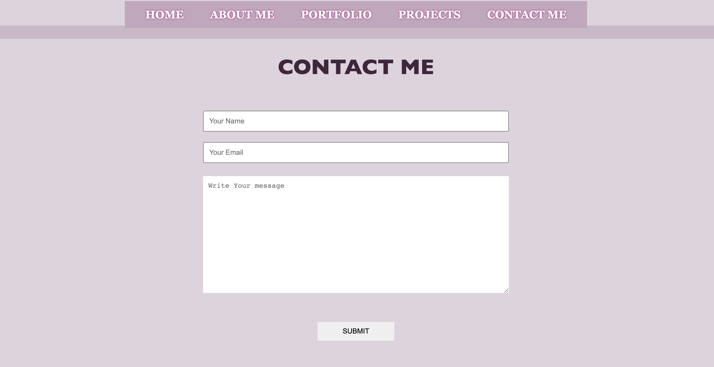

# PORTFOLIO  - a few words about me and some projects i have done
<!-- > Live demo [_here_](https://www.example.com). -->

## Table of Contents
- 
  - [Table of Contents](#table-of-contents)
  - [General Information](#general-information)
  - [Technologies Used](#technologies-used)
  - [Screenshots](#screenshots)
  - [Project Status](#project-status)
  - [Room for Improvement](#room-for-improvement)
  - [Contact](#contact)

## General Information
This simple website portfolio is to know me a bit better as a full stack developer.  
You can see some of my projects I have been working on past few months and for each stuck is different finall project.
During this coding jurney I learn alot informations about programing, coding and developing.

 

## Technologies used in this Portfolio
- JavaScript
- Html 5
- CSS

 

## Screenshots

 

## Project Status
Project MVP: _Complete_. However, additional features planned.
 

## Room for Improvement

Room for improvement:
- CSS Responsiveness
> Aesthetic design and ease of use across a variety of device screen sizes 
- CSS File Organization
> Potentially allocate a CSS file for each HTML template page
 

 

## Contact
Created by [@veronikakontos](https://www.linkedin.com/in/veronika-kontogiannopoulos/) - feel free to contact me!
